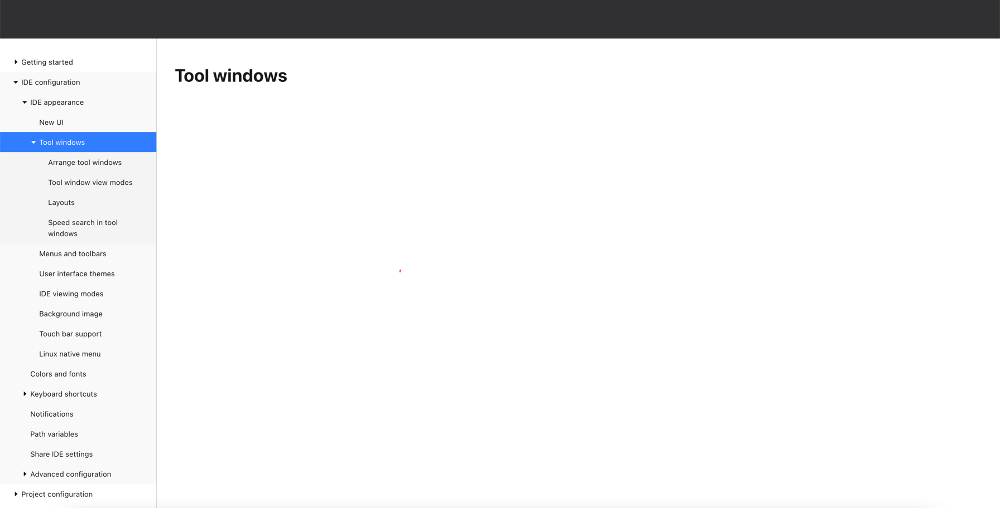

# TableOfContents

Project is built using [Next.js](https://nextjs.org/) React framework.

## Getting Started

### Install all required dependencies:

1) Install nvm, https://github.com/nvm-sh/nvm#install-script

2)  Install and use NodeJS version specified in the .nvmrc
```shell
nvm install
nvm use
```

3) Install packages
```shell
npm install
```

### Run the development server:

```shell
npm run dev
```

Open [http://localhost:3000](http://localhost:3000) with your browser to see the result.

### Run linting:

```shell
npm run lint
```

### Run tests:

```shell
npx playwright install  
npx playwright test   
```